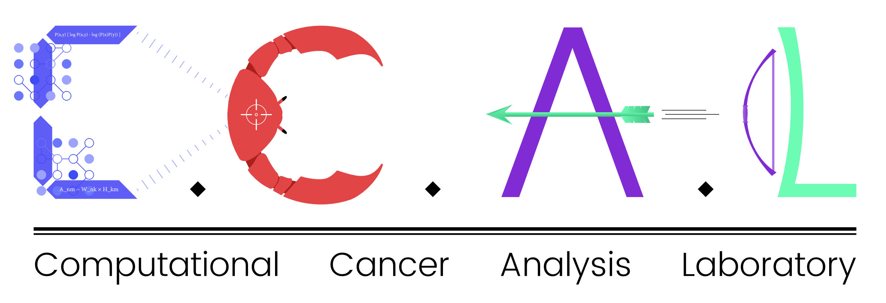

<h2 align="center">
   
  
   
  DiSCoVER Paper Analysis
   
</h2>
  
<h1 <a href="http://www.cell.com/cell-systems/fulltext/S2405-4712(17)30335-6" target="blank">Decomposing Oncogenic Transcriptional Signatures to Generate Maps of Divergent Cellular States</a></h1>
  

    

